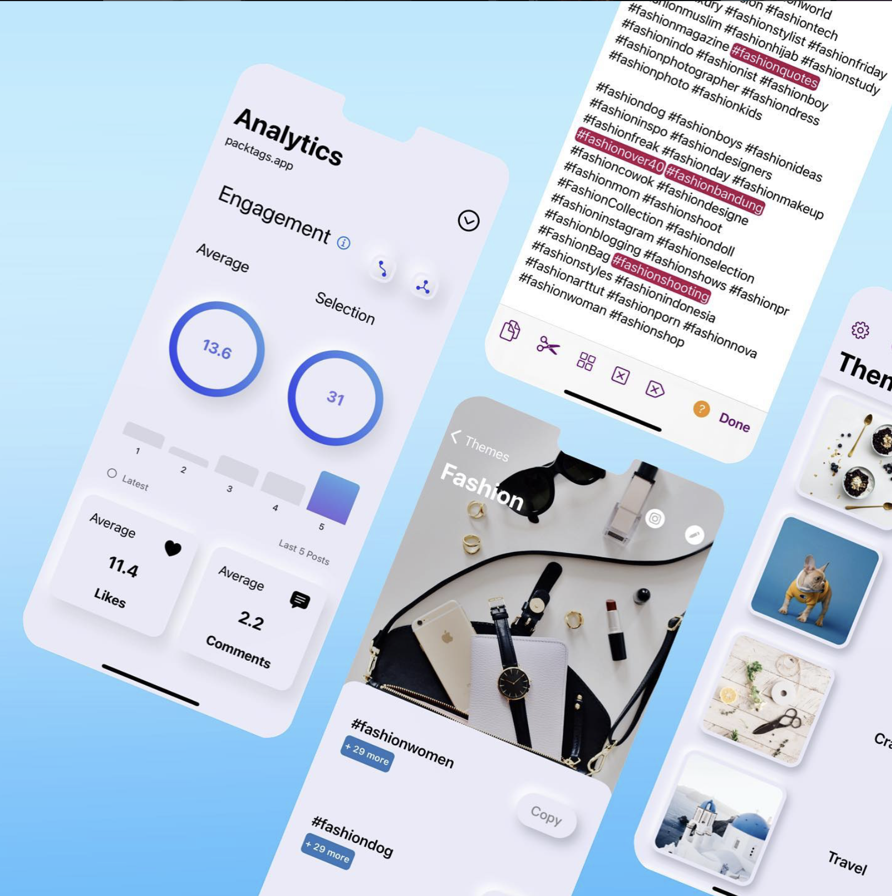
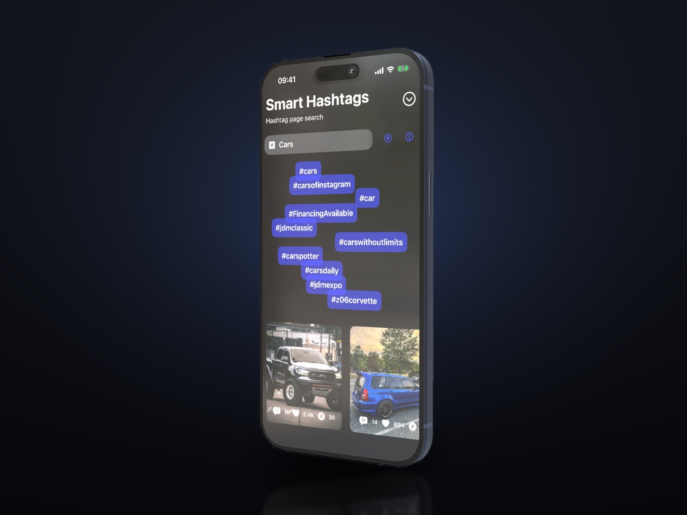
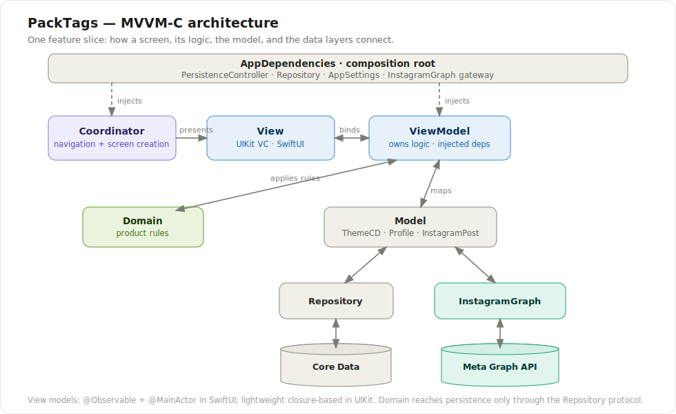
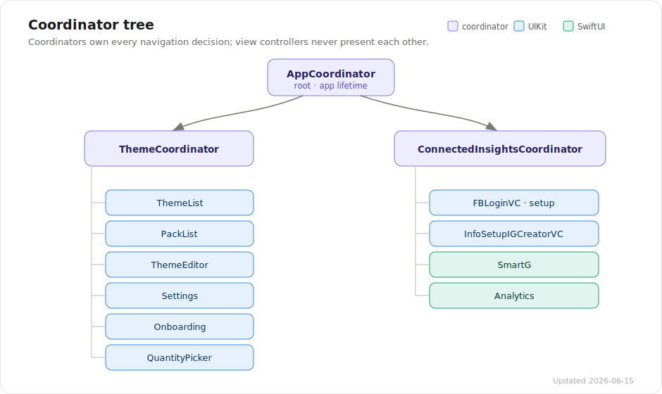

# PackTags

**A hashtag manager for Instagram creators — shipped on the App Store.**


## Overview

Creators reuse the same hashtags every day, but Instagram gives them nowhere to keep, clean, or reason about them. PackTags is that missing notebook: save hashtags as reusable themed packs, copy a pack in one tap, and keep every list tidy. Connect an Instagram Business account — through the **official Meta Graph API** — and it also surfaces trending hashtags and shows how your recent posts performed.

Built with UIKit + SwiftUI on an MVVM-C architecture, fully testable.

## Screenshots

*Themed packs, the tap-to-select hashtag editor, dark mode, post analytics, and Smart Hashtags discovery.*

<p align="center">
  
</p>

<p align="center">
  
  &nbsp;&nbsp;
  
</p>

<p align="center">
  
</p>

## Features

- **Themed packs** — organize your hashtags and copy a whole pack in one tap.
- **Import & cleanup** — lift hashtags straight out of any screenshot, then auto-remove duplicates across themes and strip invalid tags.
- **Hashtag discovery** — find new hashtags pulled live from trending Instagram posts.
- **Post analytics** — engagement, reach and views for your recent posts.

## Architecture

PackTags follows **MVVM-C** — Model · View · ViewModel · Coordinator — over a Domain / Repository core, wired by a single composition root.

<p align="center">
  
</p>
<p align="center"><em>Figure 1 — how one feature slice fits together.</em></p>

- **Coordinators own navigation.** A coordinator builds a screen's view model from the shared `AppDependencies`, injects it into the view, and performs every push/present. Views never reach for another screen.
- **View models own the logic**, with dependencies passed through `init`. SwiftUI screens use `@Observable`, `@MainActor` view models the view drives from `.task`; the UIKit notebook uses lightweight view models that signal changes through a closure.
- **Model.** `ThemeCD` (the Core Data entity) is the notebook's model; the insights features decode remote models — `Profile`, `InstagramPost` — and map them to presentation types.
- **Domain holds the product rules.** Parsing, de-duplication and pack chunking are small types, free of UIKit and reaching persistence only through the `Repository` protocol.
- **Two data sources, one shape.** Local data flows through a `Repository` over Core Data; remote data flows through the `InstagramGraph` package behind an `async` gateway. The app target contains no networking code of its own.

### Coordinator tree

`AppCoordinator` lives for the app's lifetime and starts the two area coordinators — the UIKit notebook and the SwiftUI insights — each of which presents its own screens.

<p align="center">
  
</p>
<p align="center"><em>Figure 2 — every navigation path in the app (updated 2026-06-15).</em></p>

## Engineering highlights

Built on current Apple APIs rather than legacy patterns:

| Concern | API |
|---|---|
| State (SwiftUI) | `@Observable` + `@State` — no `ObservableObject` / `@Published` |
| Concurrency | `async`/`await`, `@MainActor` isolation; Swift 5 mode with `SWIFT_STRICT_CONCURRENCY = complete` |
| In-text search | `UIFindInteraction` system find panel |
| Photo picking | `PHPickerViewController` (out-of-process, no permission prompt) |
| OCR | Vision `VNRecognizeTextRequest` |
| Connectivity | `NWPathMonitor` |
| Hashtag parsing | Swift Regex |
| Reviews | StoreKit `AppStore.requestReview` behind a launch/version policy |
| Logging | `os.Logger` categories — no `print()` |

## Case study — diagnosing the Connected Insights / ATT regression

After upgrading the Facebook SDK (9 → 18), Instagram analytics silently stopped loading: the access token looked valid, but the Graph API rejected it with `Cannot parse access token`. Rather than guess, I instrumented the login flow and ran a controlled **on-device test matrix** — allow vs. deny App Tracking Transparency, each followed by a live `/me` probe — and proved the root cause:

> **FBSDK 17+ ties the classic Graph token's validity to ATT consent.** Deny tracking and the SDK silently issues an unusable Limited-Login token; forcing the in-app advertiser flag doesn't help, because the OS ATT status wins.

The fix ships the constraint *honestly*: a SwiftUI setup flow (`FBLoginView`) that surfaces the tracking state, routes the user to the one place iOS lets them change it, and **degrades gracefully** — deny tracking and you lose only the analytics feature, not the app. The full investigation, the alternatives weighed (classic Facebook Login vs. the newer Instagram Login), and the decision to defer the migration are written up as an architecture decision record:

📄 **[docs/CONNECTED_INSIGHTS_ATT.md](docs/CONNECTED_INSIGHTS_ATT.md)**

## Dependencies

Managed with Swift Package Manager (resolved automatically when you open the project).

| Package | Role |
|---|---|
| https://github.com/A-bv/InstagramGraph | remote data layer wrapping the Meta Graph API |
| https://github.com/A-bv/TapTagKit | tap-to-select hashtags in any `UITextView` |
| https://github.com/A-bv/TableViewControllerCoverKit | table list over a stretchy cover image |
| https://github.com/facebook/facebook-ios-sdk | authentication |

`InstagramGraph`, `TapTagKit` and `TableViewControllerCoverKit` are first-party packages — extracted from PackTags and maintained separately, so the networking and reusable UI evolve independently of the app.

## Installation

**Requirements:** a recent Xcode with the iOS 17 SDK.

```sh
git clone https://github.com/A-bv/PackTags.git
open "PackTags/PackTags.xcodeproj"   # Xcode resolves the Swift packages on open
```

Run the **PackTags** scheme on any iOS 17+ simulator (⌘R). The notebook works offline; the connected features need an Instagram Business account, which the app walks you through linking.

## Testing

```sh
xcodebuild -project PackTags.xcodeproj -scheme PackTags \
  -destination 'platform=iOS Simulator,name=iPhone 17 Pro' test
```

Unit tests use **Swift Testing** and run the domain rules, the repository (on an in-memory Core Data store), view-model decisions, and coordinator wiring.

## Roadmap

- **Crash & error reporting** — evaluating Sentry vs. Firebase Crashlytics.
- **Swift 6 language mode** — strict concurrency is already `complete`.

## Author

Built and maintained by [A-bv](https://github.com/A-bv).
